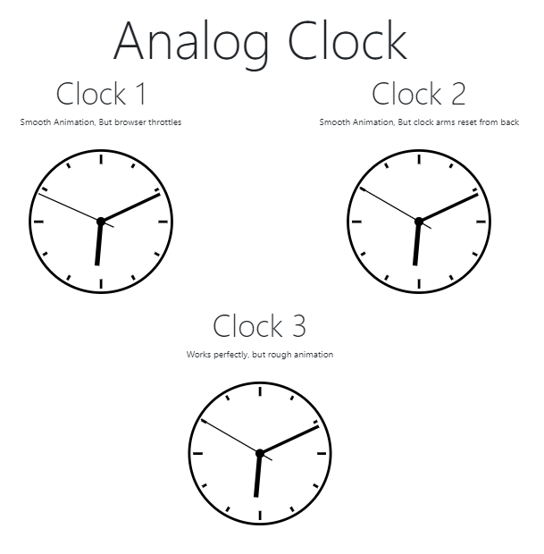

## Analog Clock
3 varients of Analog Clock
 * Clock 1: Smooth animation. But throttles when browser tabs are switched
 * Clock 2: Smooth animation. Seconds arm goes in reverse direction to reset
 * Clock 3: Rough animation. Clock arms work perfectly

 
 > Technologies used: JavaScript, Bootstrap and Node (lite-server)
 
 

